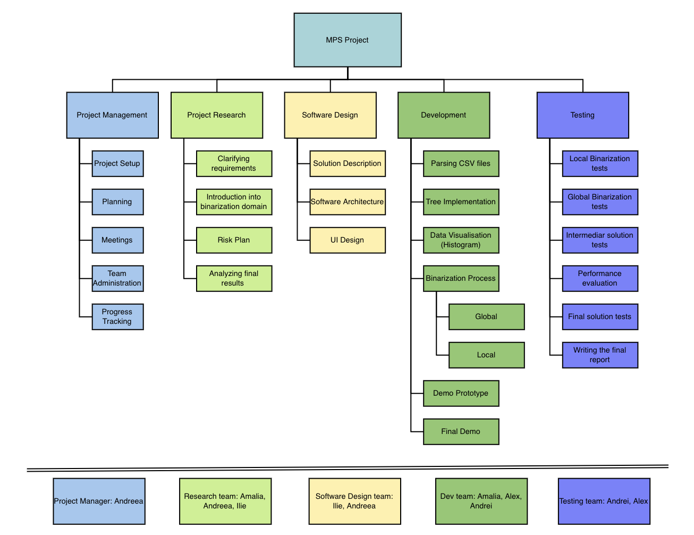

# MPS-Project

## Milestone 1

### Team Organization

First thing done was the setup part consisting in creating a `GitHub repository` for everyone to have access and giving the possibility to keep updated with the project status.

After that, we have started by going through the project requirements together in order to build the `WBS (Work Breakdown Structure)`. Thus, we divide the problem into tasks and subtasks which we thought would help us keep things organized and form an overview of what we are going to do in the following period.

After this first task together, as we talked, each of us left it clear which part he would like to work on. However, we tried to be distributed as equally possible in order to not overwhelm someone with more workload than necessary.

The next step was the `Gantt Graphic`. This planning part helped us sketch a timeline of the project, considering all the milestones and the workload we have to do between them. We had to deep dive in each task previously defined in WBS, which made us aware of what we would need in order to complete the issue. 

### Roles

* **Project Manager:** *Andreea Tătulescu*
* **Software Architect:** *Ilie Burdîniuc*
* **Developers:** *Alexandru Dobre*, *Amalia Gruia*
* **QA Tester:** *Andrei Pădureanu*

### Methodology used

We chose to work in 3 weeks sprints, using `Agile scrum methodology`. In order to keep a record of the tasks and their status, we will use a [Trello board](https://trello.com/b/ErNesWJF/mps-project).

The goal of each sprint is basically to complete the related milestone.

The reason behind our decision to use this methodology is the need to finish the project in a fairly short period of time, hoping that this way of working will increase productivity and will keep us focused on the current sprint’s objectives.

### Risk Management Plan

Every project is exposed to risks, but the key is how we treat those unfortunate situations which may occur.

After setting project objectives, we could easily identify risks because they are closely linked. In order to prepare some strategies, we analyzed the potential impact of each action and set the most likely to happen scenario.

Thus, we have elaborated the [Risk Management Plan](<https://docs.google.com/spreadsheets/d/1FHvk3Qo5tC1G0ROmzbTyDzAk8Xa9e9Wx/edit?usp=sharing&ouid=104984308872486268779&rtpof=true&sd=true>).

### Team Progress

We discuss the main issues during weeklies. Besides these, we met after important steps were made. All the calls were via [Google Meet](<https://meet.google.com/>). 

In order to keep track of tasks status, we use the [Trello board](https://trello.com/b/ErNesWJF/mps-project) previously mentioned, which is now populated.

Git commits are also useful in order to know about each other's progress. 

We have even a [SharePoint](<https://ctipub.sharepoint.com/sites/MPS-Project>) to store all documentation files and weekly notes.

We couldn't fully respect the initial plan and work according Gantt diagram because we were slow downed by the performance of the programming language chosen, but in the end we managed to achieve all the objectives set for the 2nd milestone.

### Monitoring, evaluation and project development control

We are going to have `RETRO` after the 2nd milestone in order to get feedback and visualize where we are now on the roadmap. This will be followed up by `PLANNING`, deciding which are the next steps and defining responsibilities for each team member.

Also, we started the first round of feedback, collecting answers by completing the following [form](<https://forms.office.com/e/Ba72jrc7eX>). 

### Testing Report

The testing part was made using JUnit: [Testing Report](<https://docs.google.com/document/d/1GaIZr_L488cQh0SpKmMcrVQBhaKT4N0sTBvp1mGzadQ/edit>).

### Conclusion

Being at the end of this project, we can definteley say that this way of working helped us organizing our tasks and getting the job done. The milestones kept us motivated and hard-working. The best part was that each team member managed to do their part on time, without anu complications, which improved the trust among us.

