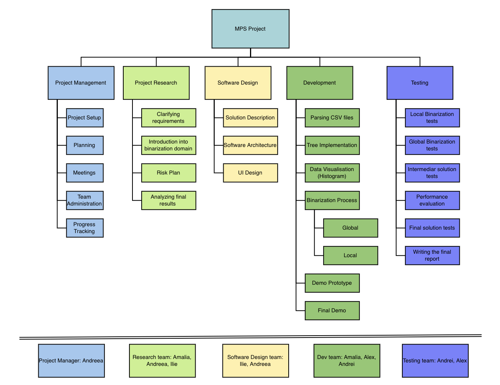

# MPS-Project

## Milestone 1

### Team Organization

First thing done was the setup part consisting in creating a `GitHub repository` for everyone to have access and giving the possibility to keep updated with the project status.

After that, we have started by going through the project requirements together in order to build the `WBS (Work Breakdown Structure)`. Thus, we divide the problem into tasks and subtasks which we thought would help us keep things organized and form an overview of what we are going to do in the following period.

After this first task together, as we talked, each of us left it clear which part he would like to work on. However, we tried to be distributed as equally possible in order to not overwhelm someone with more workload than necessary.

The next step was the `Gantt Graphic`. This planning part helped us sketch a timeline of the project, considering all the milestones and the workload we have to do between them. We had to deep dive in each task previously defined in WBS, which made us aware of what we would need in order to complete the issue. 

### Roles

* **Project Manager:** *Andreea Tătulescu*
* **Software Architect:** *Ilie Burdîniuc*
* **Developers:** *Alexandru Dobre*, *Amalia Gruia*
* **QA Tester:** *Andrei Pădureanu*

### Methodology used

We chose to work in 3 weeks sprints, using `Agile scrum methodology`. In order to keep a record of the tasks and their status, we will use a [Trello board](https://trello.com/b/ErNesWJF/mps-project).

The goal of each sprint is basically to complete the related milestone.

The reason behind our decision to use this methodology is the need to finish the project in a fairly short period of time, hoping that this way of working will increase productivity and will keep us focused on the current sprint’s objectives.

